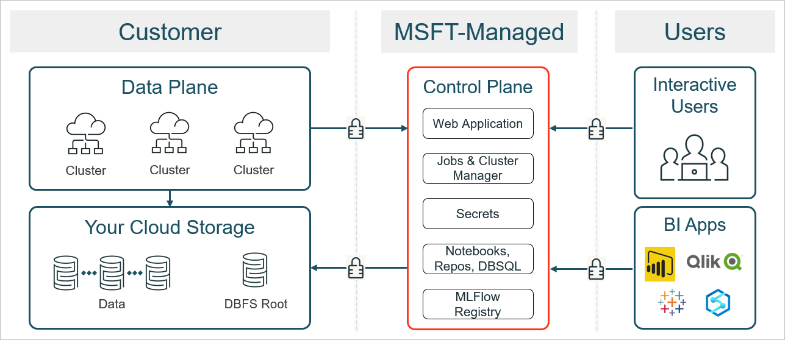
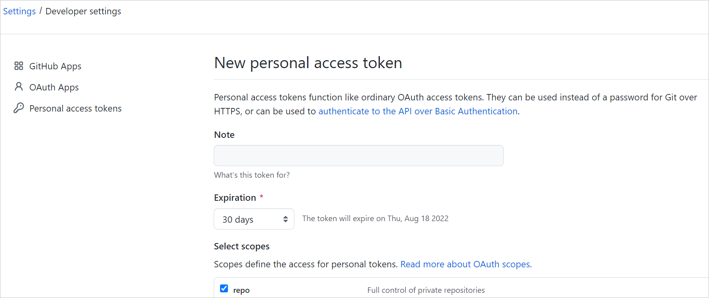
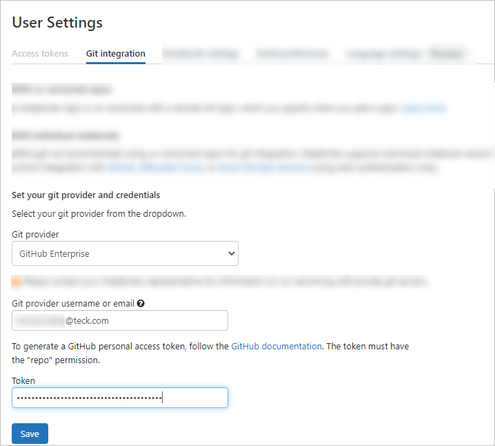

# Overview of Databricks as a Service
Para leer este documento en español, vea [ES] Descripción general de Databricks as a Service.  

This is an overview of Databricks as a Service (by Galileo Platform Team).  

Databricks as a Service (DBaaS) provides a platform that enables developers and data scientists to rapidly create, deploy, and promote Galileo-compliant applications and analytics across the organization through self-service with minimal reliance on others. DBaaS provides Databricks workspaces that are connected to data ingress with a mixture of computing to create notebooks and jobs to process data for applications and analytics.  

## Contents

## Azure Databricks architecture

*   Compute and data storage on Databricks are clearly separated so that users can leverage different types of storage formats and compute engines.  
    
*   Clusters created by Databricks create Azure VMs located within the customer’s tenant. This gives administrators fine-grained controls on implementing security controls on the infrastructure layer.  
    
*   As a first-party Azure service, users can implement various degrees of custom controls while still leveraging the benefits of being a fully managed cloud service.  
    

_

Azure Databricks architecture

## Getting started – How to access a workspace?

If you need a new Databricks workspace, you can submit a request via an [MS Office New Workspace form](https://forms.office.com/pages/responsepage.aspx?id=AMBuzvocwkmiT322PIqaUoZUIQcX4_VOmukEyDzpBnJUQU80MVoyRFZPRFM5MVUxQzk1WkxUR0M1QS4u). For more information on what you need to include in your request and what resources are provisioned by default, see How to request a new Databricks workspace.  

If you need access to an existing workspace, you can request it from the workspace owner. For more information on whom to contact and what information to provide, see How to request access to an existing workspace.  

## What are the secret scopes for workspace and storage?

A secret scope is a collection of secrets identified by a name. Secret scopes are stored in Azure Key Vault. The Galileo Platform Team creates and provisions three secret scopes in Databricks: one for the Galileo Data Team as administrators, one for the workspace, and one for any business units within the workspace.  

If you have not received the secrets, request them (the primary contact person is ). For more information, see [https://learn.microsoft.com/en-us/azure/databricks/security/secrets/secret-scopes](https://learn.microsoft.com/en-us/azure/databricks/security/secrets/secret-scopes).  

## How to integrate GitHub and Databricks?

To use DBaaS, you need to configure the integration between Databricks and GitHub.  

Firstly, generate a GitHub personal access token (PAT) for your user account:  

1.  Sign in to GitHub enterprise.  
    
2.  Select your profile icon.  
    
3.  Select **Settings** > **Developer settings** > **Personal access tokens** > **Generate new token**.  
    
4.  Select the permission scope **repo**.  
    
5.  Generate the token.  
    
6.  Copy the token to the clipboard or save it so that you can enter it in Databricks.  
    

_Page to create a personal access token_

Secondly, configure the Git integration for the user in your Databricks workspace:  

1.  Sign in to your Databricks workspace.  
    
2.  In the upper-right corner, select your account email, and then select **User Settings** > **Git Integration**.  
    
3.  For **Git provider**, select **GitHub Enterprise**.  
    
4.  For **Git provider username or email**, enter your username or email.  
    
5.  For **Token**, paste the GitHub personal access token you have generated.  
    
6.  Select **Save**.  
    

_Git integration in user settings_

## How to add a user to a workspace?

To add a user to the workspace, you need to request access for them from the workspace owner. For more information on whom to contact and what information to provide, see [How to request access to an existing workspace](#).  

When the Galileo Platform Team provisions a new user, they are added to user groups for lower environments (Pre-Dev, Dev, and QA). For higher environments (UAT and Prod), only the support team users get access and they run the pipelines instead of developers. The Data Platform Team provisions pipelines together with a workspace.  

For a tutorial on using those pipelines, see How to use pipelines from DBaaS.  

## What are local and external catalogs in Unity Catalog?

Using local and external data catalogs gives the flexibility to migrate data in .csv format to Azure Data Lake Storage (ADLS) parquet tables using the upload command.  

Data catalogs can be:  

*   **Local** that are stored in Databricks. The tables from such catalogs are called **managed**. If you delete such a table in Databricks, you lose both metadata and content.  
    
*   **External** that come from ADLS. The tables from such catalogs are called **external**. The metadata is stored in Unity, but the data itself is stored outside of Databricks. If you delete such a table in Databricks, you lose metadata, but the table and its content stay in ADLS.  
    

The `ext_dataacquisition` is an external catalog that is available for all Business Units across all environments. You receive access to the `ext_dataacquisition` catalog along with Databricks workspace access. No additional action is required.  

Objects in `hive_metastore` catalog starting with `dataacquisition_` are no longer in sync with Data Acquisition. If you need access to Data Acquisition catalog, please use the Unity Catalog `ext_dataacquisition`. For more information, see Unity Catalog for DBaaS. For refactoring your code to the new catalog, see How to migrate from Hive Metastore objects to Unity Catalog?  

External and local catalogs in Databricks

## How to share data and search for data in Unity Catalog?

By using Databricks, you can share your data with other teams and access their data. The data is synced every six hours, and all orchestrations and support are provided by the Galileo Platform team. For more information, see Unity Catalog for DBaaS.  

## How to build and maintain ETL packages (sample pipelines)?

Galileo Platform Team has prepared ready-to-use Azure DevOps (ADO) pipelines for you.  

For more information, see CI/CD process overview and How to use default CI/CD pipelines from DBaaS?  

## How to ask for a new compute (cluster)?

You can create new clusters in a workspace. Galileo Platform Team has also introduced cluster policies that help you reduce cost and simplify cluster creation.  

For more information, see How to use cluster policies and [https://teckresources.atlassian.net/wiki/spaces/GDEVGUIDE/pages/3382542609/Frequently+Asked+Questions+for+DBaaS#Compute-and-clusters](https://teckresources.atlassian.net/wiki/spaces/GDEVGUIDE/pages/3382542609/Frequently+Asked+Questions+for+DBaaS#Compute-and-clusters).  

  

_

